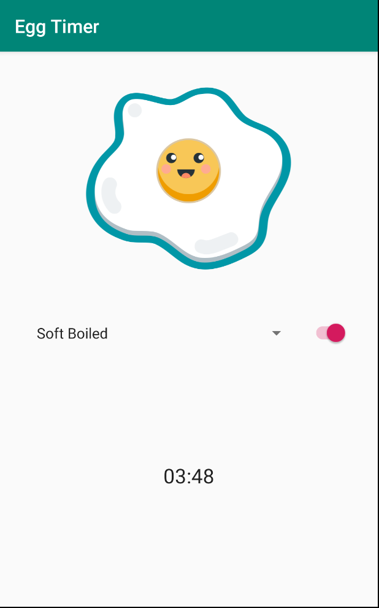
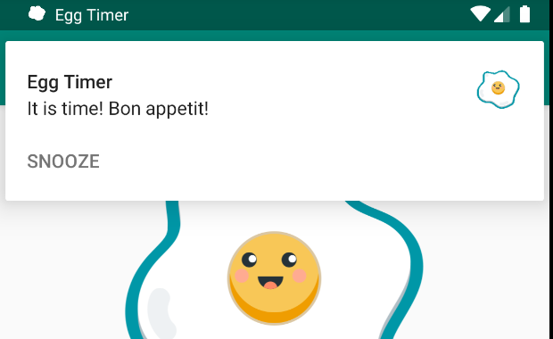
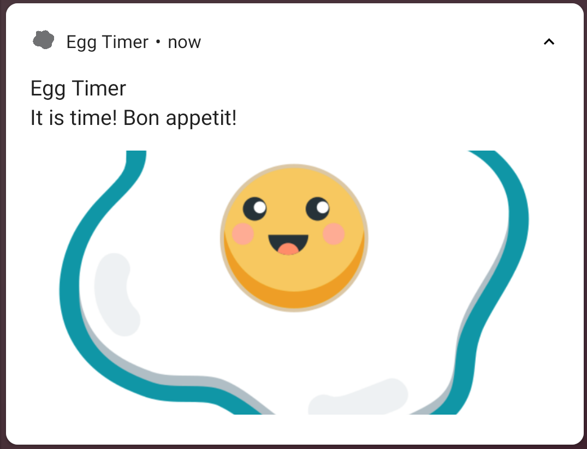

# EggTimer

Using Notifcations  
Lesson 2 of [Advanced Android with Kotlin course on Udacity](https://classroom.udacity.com/courses/ud940)

Updates:

* Latest library versions (see .gradle files) with minor code refactoring
* Steps from [Google Codelabs (01.1-2)](https://codelabs.developers.google.com/advanced-android-kotlin-training/)

## Introduction

EggTimer is a timer app for cooking eggs.
You can start and stop the timer, choose different cooking intervals.. 

Tasks:

* Add notitications to the eggtimer app.
* Use channels and importance for the app notifications.
* Customize and style the notifications.
* Add Firebase Cloud Messaging to send push notifications.

## Pre-requisites

You should be familiar with:

* Services, AlarmManager, Broadcast Receivers.

## Screenshots

